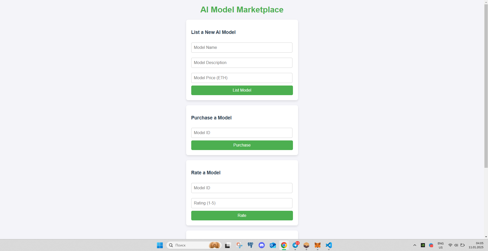

# **AI Model Marketplace**



## **Description**
`AI Model Marketplace` is a decentralized application (dApp) that allows users to:
- List AI models for sale.
- Purchase AI models securely.
- Rate purchased AI models.
- Retrieve details of listed models.
- Withdraw funds from model sales.

This project demonstrates smart contract development, frontend integration with Web3.js, and deployment to the Ethereum Holesky Testnet.

---

## **Features**
1. **List Model**: Add AI models to the marketplace.
2. **Purchase Model**: Securely purchase models using ETH.
3. **Rate Model**: Rate models after purchase.
4. **Get Model Details**: Retrieve the name, description, price, creator, and average rating.
5. **Withdraw Funds**: Model creators can withdraw funds from sales.

---

## **Project Structure**

```plaintext
arayamir/
├── contracts/             
│   └── AIModelMarketplace.sol   
├── frontend/              
│   ├── index.html           
│   ├── app.js           
│   └── style.css          
├── artifacts/             
├── README.md                
├── LICENSE                  
├── package.json             
└── hardhat.config.js        
